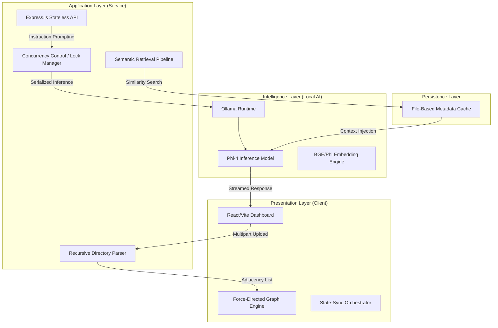

# 📂 File to Graph: Local-First Codebase Intelligence

**File to Graph** is an advanced engineering tool designed to bridge the gap between flat directory structures and semantic codebase understanding. It orchestrates a multi-layered pipeline that transforms source code into a high-dimensional vector space, rendered through an interactive force-directed graph.

Leveraging **Local LLMs (Phi-4)** and a custom **RAG (Retrieval-Augmented Generation)** engine, it provides developer-centric insights, structural optimization suggestions, and context-aware querying—all while maintaining 100% data sovereignty via local execution.

---

## 🏗️ System Architecture

The system is architected as a decoupled client-server model with a specialized intelligence orchestration layer.



---

## 🛠️ Technical Implementation Detail

### 1. Semantic Orchestration Pipeline
The backend implements a **Summary-Driven Embedding** strategy. Instead of embedding raw code (which often contains noise like boilerplate), the system:
-   **Asynchronously** generates concise semantic summaries for every node in the graph.
-   Computes high-dimensional vectors based on these summaries.
-   Persists these mappings in a local cache (`summaries.json`) to bypass redundant inference on subsequent loads.

### 2. RAG & Vector Search
-   **Engine**: Custom implementation of **Cosine Similarity** scoring over the local vector space.
-   **Retrieval Loop**: When a query is initiated, the system performs a similarity search across the embedded summary space, retrieves the top-K relevant source snippets, and injects them into the LLM context window for grounded generation.
-   **Local Inference**: Powered by `phi4-mini`, optimized for high-reasoning tasks with a small memory footprint.

### 3. Concurrency & Resource Management
To ensure stability on consumer-grade hardware, the system utilizes a **Serializing Lock Mechanism**. This prevents race conditions and VRAM exhaustion by queuing LLM requests, ensuring the local inference engine (Ollama) is never over-saturated.

### 4. Graph Visualization
The frontend renders a dynamic **Adjacency List** as a Force-Directed Graph.
-   **Node Heuristics**: Nodes are sized dynamically based on file volume (logarithmic scale) and type (Directory vs. File).
-   **Intelligent Filtering**: Implements recursive skipping for common build artifacts (`node_modules`, `.git`, etc.) to maintain graph legibility.

---

## 📦 Tech Stack

-   **Frontend**: React 18, Vite, Lucide Icons, Axios.
-   **Backend**: Node.js, Express, Multer (Memory Storage).
-   **AI Core**: Ollama Runtime, Phi-4-mini (LLM), Vector Embedding API.
-   **Styling**: Vanilla CSS with Glassmorphic design patterns and dynamic state indicators.

---

## ⚙️ Engineering Setup

### Prerequisites
-   **Node.js**: v18.0.0 or higher.
-   **Ollama**: Installed and running on `localhost:11434`.
-   **Model Acquisition**:
    ```bash
    ollama pull phi4-mini:latest
    ```

### Backend Deployment
1.  Initialize dependencies:
    ```bash
    cd backend
    npm install
    ```
2.  Launch the service:
    ```bash
    node server.js
    ```

### Frontend Deployment
1.  Initialize dependencies:
    ```bash
    cd frontend
    npm install
    ```
2.  Launch the development server:
    ```bash
    npm run dev
    ```

---

## 📝 Performance Notes
-   **Memory Footprint**: Designed to run comfortably on 8GB+ RAM.
-   **Inference Speed**: Summarization is cached; initial ingestion depends on CPU/GPU throughput via Ollama.
-   **Data Sovereignty**: Zero telemetry. All code analysis and embeddings are performed and stored on-disk locally.
