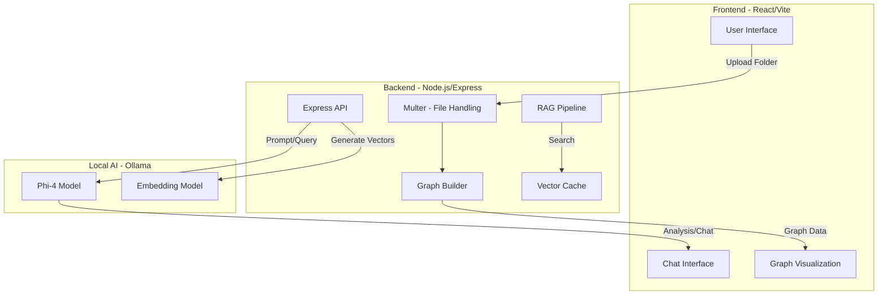

# 📂 File to Graph

**File to Graph** is a sophisticated codebase visualization and analysis tool. It transforms flat directory structures into interactive, force-directed graphs while leveraging local LLMs (Large Language Models) to provide semantic insights, code analysis, and RAG-based (Retrieval-Augmented Generation) querying.

---

## 🚀 Features

-   **Interactive Visualization**: View your project structure as a dynamic, interactive graph.
-   **Local AI Analysis**: Uses **Ollama** and **Phi-4** to analyze files without sending data to the cloud.
-   **Semantic Search (RAG)**: Chat with your codebase using vector embeddings for context-aware answers.
-   **Structure Suggestions**: Get AI-powered advice on how to improve your project organization.
-   **Persistent Caching**: Efficiently stores file summaries to speed up subsequent loads.

---

## 🏗️ System Architecture

The project follows a modern client-server architecture with integrated local AI orchestration.



---

## 🛠️ System Design

### 1. Frontend (Client Layer)
-   **React & Vite**: Fast development and optimized production builds.
-   **Force-Directed Graph**: Uses specialized visualization components to render the hierarchy as a network of nodes (files/dirs) and links.
-   **Status Polling**: Monitors backend model activity to ensure smooth user experience during heavy AI tasks.

### 2. Backend (Service Layer)
-   **Folder Parsing**: Handles recursive folder uploads and maps them to a parent-child relationship for the graph.
-   **RAG Pipeline**: 
    -   **Summarization**: Generates 1-2 sentence summaries for every code file.
    -   **Embeddings**: Converts summaries into high-dimensional vectors.
    -   **Vector Search**: Uses Cosine Similarity to find relevant snippets when the user asks a question.
-   **Concurrency Management**: Implements a lock mechanism to prevent overloading the local LLM with simultaneous requests.

### 3. AI Integration (Ollama)
-   **Inference**: All processing is done locally via Ollama.
-   **Model**: Defaults to `phi4-mini` for a balance of speed and intelligence.
-   **Persistence**: Summaries are cached in `summaries.json` to avoid redundant processing of unchanged files.

---

## 📦 Tech Stack

-   **Frontend**: React, Vite, Lucide React, Axios.
-   **Backend**: Node.js, Express, Multer.
-   **AI**: Ollama, Phi-4 (Analyze & Chat).
-   **Styling**: Modern CSS with Glassmorphism aesthetics.

---

## ⚙️ Installation & Setup

### Prerequisites
-   [Node.js](https://nodejs.org/) (v18+)
-   [Ollama](https://ollama.ai/) installed and running.
-   Pull the required model:
    ```bash
    ollama pull phi4-mini:latest
    ```

### Backend Setup
1. Navigate to the `backend` folder:
   ```bash
   cd backend
   ```
2. Install dependencies:
   ```bash
   npm install
   ```
3. Start the server:
   ```bash
   node server.js
   ```

### Frontend Setup
1. Navigate to the `frontend` folder:
   ```bash
   cd frontend
   ```
2. Install dependencies:
   ```bash
   npm install
   ```
3. Start the development server:
   ```bash
   npm run dev
   ```

---

## 📝 License

This project is for educational and productivity purposes. Local data stays local.
